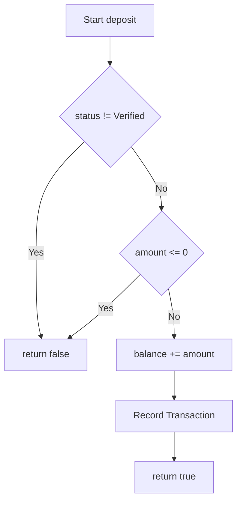
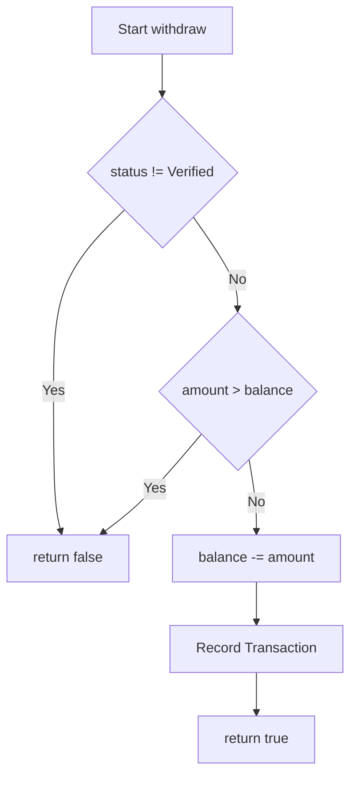

# Section B: White-Box Testing

## 1. Decision Paths & Branch Coverage

### `deposit(double amount)`

```java
public boolean deposit(double amount) {
    if (status != AccountStatus.Verified || amount <= 0) return false;
    balance += amount;
    // ... logic ...
    return true;
}
```

**Paths:**
1. `status != AccountStatus.Verified` is TRUE -> Returns `false`
2. `status == AccountStatus.Verified` AND `amount <= 0` is TRUE -> Returns `false`
3. `status == AccountStatus.Verified` AND `amount > 0` is TRUE -> Returns `true`

### `withdraw(double amount)`

```java
public boolean withdraw(double amount) {
    if (status != AccountStatus.Verified || amount > balance ) return false;
    balance -= amount;
    // ... logic ...
    return true;
}
```

**Paths:**
1. `status != AccountStatus.Verified` is TRUE -> Returns `false`
2. `status == AccountStatus.Verified` AND `amount > balance` is TRUE -> Returns `false`
3. `status == AccountStatus.Verified` AND `amount <= balance` is TRUE -> Returns `true`

## 2. Control Flow Graph (CFG) for `deposit`



## 3. Control Flow Graph (CFG) for `withdraw`


